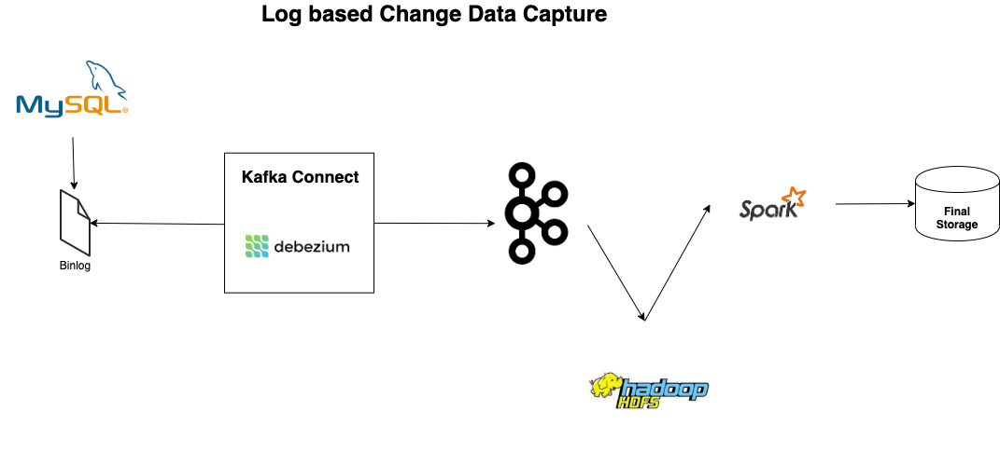

# Log based Change Data Capture (CDC) with Debezium and Kafka Connect

* The CDC process is a more non-intrusive approach and does not involve the execution of SQL 
  statements at the source.

* Instead, this method involves reading log files of the source database to identify the data 
  that is being created, modified, or deleted from the source into the target Data Warehouse.

  Transactional databases store all changes in a transaction log in order to recover the 
  committed state of the database should the database crash for whatever reason.

* At a high level, there are several techniques and technologies for handling the change data 
  capture processes (CDC process). 

  Example -
  - Oracle GG
  - Debezium

## Tech Stack used

This project has been inspired from [this](https://www.startdataengineering.com/post/change-data-capture-using-debezium-kafka-and-pg/)
article.

* Docker
* Zookeeper
* Kafka
* Kafka Connect
* MySQL
* Debezium
* Spark

## High level dataflow

For this demo, the sink is local file system instead of HDFS (as shown in the diagram)

References
===========
https://www.hvr-software.com/blog/change-data-capture/

https://debezium.io/blog/2018/07/19/advantages-of-log-based-change-data-capture/

https://hevodata.com/learn/change-data-capture-cdc-etl/